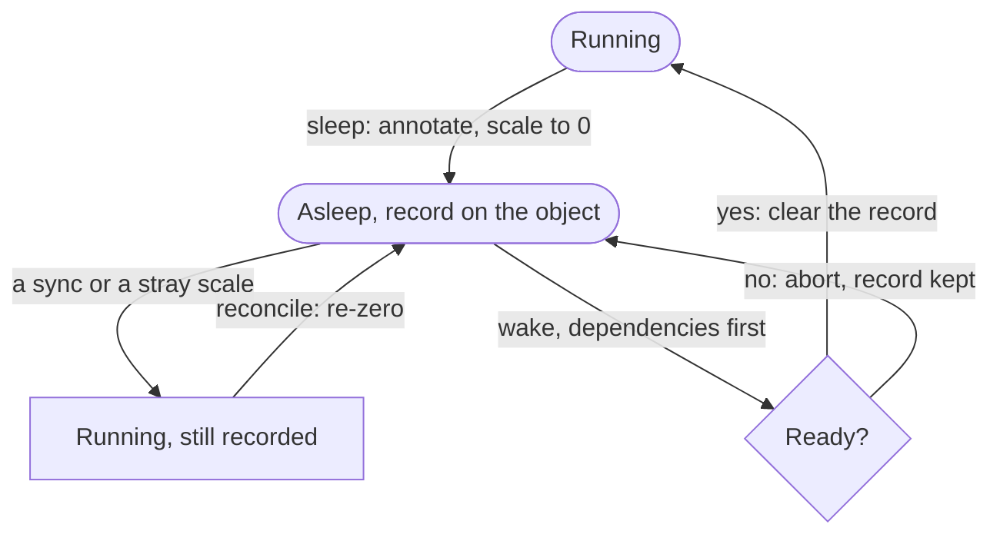

+++
title = 'Hibernating Kubernetes Namespaces with a Helm Chart'
date = 2026-09-18T09:00:00+01:00
draft = false
+++

Most non-production namespaces do nothing for most of the day. A full stack of database, identity provider, object storage and a dozen services runs around the clock so that a pipeline can use it for forty minutes overnight.

Scaling it all to zero is easy. Doing it in a way that survives GitOps, comes back up in the right order, and can be dropped into any namespace without a platform team is the interesting part. I recently built a small Helm chart that does that: three CronJobs, a Role and a shell script. These are the design decisions that turned out to matter.

## Overview

- **Namespace-local**: the job finds its own namespace through the downward API. Installing the chart *is* the opt-in.
- **State on the objects**: pre-sleep replica counts are annotations on the workloads themselves, so every action is idempotent.
- **Ordered and gated**: dependencies wake first, each must come ready before the next, and one that doesn't aborts the wake.
- **Self-healing**: a reconcile job re-sleeps anything a GitOps sync or a stray `kubectl scale` brought back.
- **Inert by default**: dry-run on and no dependencies declared, so a fresh install logs a plan and changes nothing.
- **Testable**: the script is a real file, linted and run against a stubbed CLI in CI.

## Namespace-local

The tempting design is one CronJob somewhere central with a list of target namespaces and a ClusterRole. That needs cluster-scoped RBAC that a per-namespace GitOps model can't grant, and one bad entry in the list sleeps the namespace running the pipelines.

So the job reads its namespace from the pod spec and touches nothing else:

```yaml
env:
  - name: NAMESPACE
    valueFrom:
      fieldRef:
        fieldPath: metadata.namespace
```

RBAC is a `Role` and a `RoleBinding` in the release namespace: scale on Deployments and StatefulSets, patch on CronJobs, read on pods. No ClusterRole, no target list. To hibernate a namespace you install the chart into it with that environment's values, through whatever already deploys the rest of it. Whoever owns the namespace owns the schedule.

## State lives on the objects

Waking means knowing what the namespace looked like before it slept. A ConfigMap of `name: replicas` pairs is the obvious store, and its failure modes are awful: a half-completed sleep leaves it describing a state that doesn't exist, and a half-completed wake has to decide whether to trust it.

Instead the record goes on the object it describes:

```bash
kubectl annotate deployment/api pre-sleep-replicas=3 --overwrite
kubectl scale deployment/api --replicas=0
```

Annotate, then scale. On wake: scale, then clear the annotation. The record is only removed once the restore has been accepted, so a failed wake leaves it in place for the next attempt, and both actions are idempotent for free. Every transition a workload can make is driven by whether it carries a record:



One case matters. A workload that carries the annotation but is running again was put back by something else while asleep. The right move is to re-zero it *while keeping the original count*. Overwriting the annotation with the current count is the bug you'd write by accident, and it would leave you waking to whatever the sync happened to set.

CronJobs get a matching `pre-sleep-suspend` annotation, so a job that was already suspended before the sleep stays suspended after the wake.

## Order and gating

Scaling everything to zero at once is fine. Scaling it back up at once is not: the application tier starts, finds no database, and crash-loops until half of it is in backoff. The wake succeeds and the environment is broken.

The chart takes a list of what everything else depends on, most-depended-on first:

```yaml
dependencies:
  - postgres
  - auth-postgres
  - auth
  - object-store
```

A workload belongs to an entry when its name is the entry or starts with `<entry>-`, claimed by the first match, so `auth-postgres` isn't swallowed by `auth`. Everything unmatched is a dependant.

Sleep runs the list backwards: suspend CronJobs, scale the dependants to zero, wait for their pods to terminate, then take the dependencies down. Wake runs it forwards, and each dependency must pass `rollout status` before the next starts:

```bash
kubectl scale "$kind/$name" --replicas="$saved"
kubectl rollout status "$kind/$name" --timeout=300s || exit 1
```

One that doesn't come ready aborts the whole wake, leaving the dependants at zero with their annotations intact. That is deliberately harsh. A namespace cleanly asleep with a failed job in its history is a far better place to debug from than twelve services crash-looping against a StatefulSet with a stuck init container. Once the dependency is healthy, re-running the wake is safe because the records are still there.

## GitOps will fight you

The namespace sleeps on schedule and half an hour later it's back, unordered, application tier before database. The GitOps controller noticed `spec.replicas` differed from the manifest and put it back.

In Argo CD the fix has two halves, and most people only do the first:

```yaml
ignoreDifferences:
  - group: apps
    kind: Deployment
    jsonPointers:
      - /spec/replicas
syncPolicy:
  syncOptions:
    - RespectIgnoreDifferences=true
```

`ignoreDifferences` alone only stops the drift being *reported*. A sync still writes the field. `RespectIgnoreDifferences` is what makes it leave the field alone, and it isn't the default.

The chart doesn't rely on that being configured. A third CronJob, `reconcile`, runs on a short cadence and re-zeroes anything that carries a record but is running:

```bash
[ -n "$saved" ] && [ "$replicas" -gt 0 ] && kubectl scale "$kind/$name" --replicas=0
```

On a woken namespace nothing is annotated, so it's a no-op. It needs no knowledge of the schedule to decide whether the namespace is *meant* to be asleep. The annotation is the source of truth for that too.

## Not sleeping yourself

The CronJobs doing the sleeping are CronJobs in the namespace being slept. The first dry run cheerfully proposed suspending `hibernate-wake`, which would have been a quiet way to end the experiment.

The chart labels its own CronJobs `hibernate=exclude` and sleep lists with a `!=` selector. The same label keeps anything else running through a sleep: a log shipper, a metrics exporter, whatever lets you see the namespace is down.

Wake ignores the label entirely. It restores anything carrying the annotation, so labelling a workload as excluded *after* it was slept can't strand it at zero. Sleep respects the label; wake respects the record.

## Fail before you mutate

A Role can be trimmed by an admission policy without anyone noticing. If the job can list Deployments but not StatefulSets, a naive script sleeps the Deployments, sees an empty StatefulSet list, logs success and leaves the database running with nothing in front of it. The next wake finds no StatefulSet annotations and reports everything restored.

So before anything is touched, every kind is listed once, and a listing that *fails* is fatal:

```bash
for kind in deployment statefulset cronjob; do
  kubectl get "$kind" -o name >/dev/null || exit 1
done
```

An empty result is fine. A refused one is exactly the gap that produces a half-asleep namespace.

## Inert until told otherwise

Every default is chosen so that an install with no values does nothing:

```yaml
dryRun: true
dependencies: []
```

Dry run logs every command it would run and exits zero. Install, trigger a job by hand, read the plan, fix the dependency list, then turn it off:

```bash
kubectl create job hibernate-sleep-$(date +%s) --from=cronjob/hibernate-sleep
```

Creating a job from the CronJob works whether or not the schedule is suspended, so the same command wakes an on-demand environment for a support session. The chart ships profiles for the usual shapes: a fixed window, working hours with a time zone so the schedule tracks daylight saving, on-demand with wake permanently suspended, and on-demand with a nightly sleep so a session left running tidies itself up.

## A script you can test

The job runs a bash script that lives as a real file under `scripts/`, packaged into a ConfigMap at render time:

```yaml
data:
  hibernate.sh: |
{{ .Files.Get "scripts/hibernate.sh" | indent 4 }}
```

That one decision makes the rest possible. Shellcheck runs against the real file. Every CLI call goes through one `cli()` wrapper, so `oc` and `kubectl` are interchangeable and the tests can put a stub on the `PATH`. The stub is a hundred lines of bash that keeps one file per object in a temp directory, honours `!=` selectors, fails a rollout or a scale on demand, and appends every mutating call to a log. That's enough to assert ordering, which is most of what the chart is about:

```bash
t "apps drain before data goes" [ "$(logline 'get pods')" -lt "$(logline 'scale statefulset/postgres')" ]
```

Fourteen scenarios, a few seconds, no cluster. The ones that earn their keep are the ugly ones: a sync restoring a workload mid-sleep, a dependency that never comes ready, a scale that fails and must keep its annotation, a kind that can't be listed. CI also renders the chart and diffs the packaged script against the source, because a ConfigMap that silently lags the file it claims to contain is a Sunday bug.

## What I'd still change

Nothing wakes the namespace when a deployment lands. A pipeline against a sleeping environment fails, and the fix is a wake step at the front of every pipeline. The chart could watch for that, but that means a webhook or a controller, and the point was three CronJobs and a script.

The dependency list is also flat. It says "these before those" but not "these two in parallel, then that". For four entries it doesn't matter. For three independent databases it makes the wake a minute slower than it needs to be.

But the shape holds. Kubernetes already had the primitives: a CronJob, a Role, an annotation, `rollout status`. The chart is mostly about the order you use them in, and about refusing to act when the result can't be trusted.
