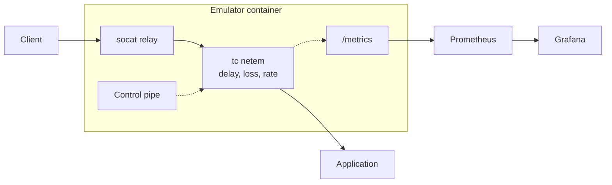

+++
title = 'Emulating Satellite Links with tc and netem'
date = 2025-02-25T12:00:00+00:00
draft = false
+++

Using socat, Linux traffic control (tc) and netem, we can emulate realistic satellite link network conditions. The great thing about this approach is that it's completely portable - you can drop it in front of any service without modifying the target application.

## Overview

- **Realistic Network Emulation**: Simulate various satellite scenarios from LEO to GEO
- **Real-time Monitoring**: Expose metrics via Prometheus and visualize in Grafana
- **Runtime Control**: Change network conditions on the fly
- **Portable Proxy Design**: Drop-in containerized solution that works with any service

## Technical Implementation

Here's how to build a network emulator using common Linux tools and containers:

### Containerized Proxy Architecture

This containerized approach provides several benefits:

1. **Portable**: Run it locally, in CI/CD, or in production
2. **Isolated**: Network conditions don't affect the host system
3. **Self-contained**: Includes all necessary tools and monitoring

The emulator sits between the client and the application. `socat` relays the traffic, `tc netem` shapes it on the way through, and a metrics endpoint reports the conditions currently applied:



Implement as a self-contained Docker container that acts as a transparent proxy:

```yaml
services:
  # Your target application
  app:
    image: your-app:latest

  # Network emulator proxy
  emulator:
    image: network-emulator:latest
    environment:
      - UPSTREAM_HOST=app
      - MODE=cycle
      - CYCLE_SCENARIOS=low_latency,high_latency
    ports:
      - "80:80"
      - "443:443"
    cap_add:
      - NET_ADMIN
    depends_on:
      - app

  # Optional monitoring
  prometheus:
    image: prom/prometheus:latest
    volumes:
      - ./monitoring/prometheus:/etc/prometheus
    ports:
      - "9090:9090"

  grafana:
    image: grafana/grafana:latest
    volumes:
      - ./monitoring/grafana:/var/lib/grafana
    ports:
      - "3000:3000"
```

> **Note:** The emulator container needs `NET_ADMIN` to modify network interfaces.

### Network Proxy with socat

At the heart of the emulator is `socat`, a flexible, multi-purpose relay tool. It acts as a transparent proxy, forwarding traffic between the client and a specified upstream host:

```bash
socat -v TCP-LISTEN:80,fork,reuseaddr TCP:${UPSTREAM_HOST}:80
```

### Network Emulation with tc netem

The network conditions are applied using Linux's traffic control (`tc`) with the `netem` module. Here's how different satellite scenarios are implemented:

```bash
# LEO satellite with good conditions
tc qdisc add dev eth0 root netem \
  delay 400ms 30ms \
  loss 0.5% \
  rate 9mbit

# GEO satellite during heavy rain
tc qdisc add dev eth0 root netem \
  delay 600ms 100ms \
  loss 10% \
  corrupt 2% \
  rate 2mbit
```

We can dynamically update the conditions using a control script to monitor a named pipe for commands during runtime:

```bash
# Switch to heavy rain scenario
echo "set heavy_rain_satellite" > /tmp/netem_control

# Start automatic cycling
echo "cycle" > /tmp/netem_control

# Remove all network conditions
echo "set none" > /tmp/netem_control
```

The control script is a loop reading from a FIFO:

```bash
mkfifo /tmp/netem_control
while read -r command < /tmp/netem_control; do apply_scenario "$command"; done
```

### Metrics Collection

A small exporter polls `tc` and publishes what it finds as Prometheus gauges:

```go
out, _ := exec.Command("tc", "-s", "qdisc", "show", "dev", "eth0").Output()
networkDelay.Set(parseDelay(string(out)))
http.Handle("/metrics", promhttp.Handler())
```

Metrics are exposed via an endpoint (`/metrics`) in the standard Prometheus format:

```text
network_delay_ms 600
packet_loss_percent 1
bandwidth_kbps 2048
```

These metrics are then scraped by Prometheus and visualized in Grafana, providing real-time insights into the network conditions:

```yaml
scrape_configs:
  - job_name: "satellite-emulator"
    static_configs:
      - targets: ["localhost:9091"]
    scrape_interval: 1s
```

## Use Cases

This pattern can be useful for:

- Testing application behavior under various network conditions
- Evaluating protocol performance
- Automated testing in CI/CD pipelines
